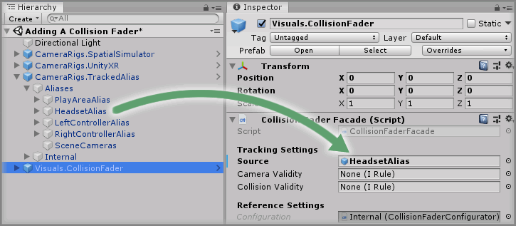
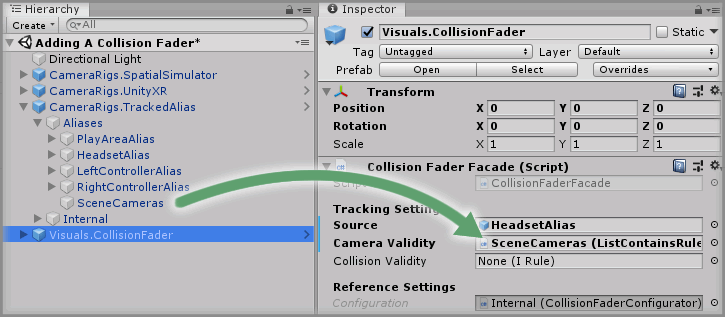
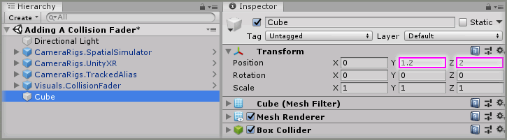

# Adding A Collision Fader

> * Level: Beginner
>
> * Reading Time: 5 minutes
>
> * Checked with: Unity 2018.3.14f1

## Introduction 

The `Visuals.CollisionFader` prefab provides the ability to fade the main camera view if the user's headset collides with other geometry within the [Unity] scene.

## Prerequisites

* [Add the Tilia.CameraRigs.TrackedAlias.Unity -> CameraRigs.TrackedAlias] prefab to the scene hierarchy.
* [Install the Tilia.Visuals.CollisionFader.Unity] package dependency in to your Unity project.

## Let's Start

### Step 1 

Add a `Visuals.CollisionFader` prefab to the Unity project hierarchy by selecting `GameObject -> Tilia -> Prefabs -> Visuals -> Visuals.CollisionFader` from the Unity main top menu.

### Step 2

The collision fader tracks a source GameObject to determine when a collision has occurred with other scenery and therefore we can use our Headset Alias to allow the collision fader to track our head position.

Expand `CameraRigs.TrackedAlias -> Aliases` and drag and drop the `HeadsetAlias` GameObject into the `Source` property on the `Collision Fader Facade` component within the `Visuals.CollisionFader` GameObject.

### Step 3

We also need to tell our collision fader which scene cameras we want to actually perform the fade on. We can use the Scene Cameras Alias to make this easier to link all known CameraRig camera aliases.

Expand `CameraRigs.TrackedAlias -> Aliases` and drag and drop the `SceneCameras` GameObject into the `Camera Validity` property on the `Collision Fader Facade` component within the `Visuals.CollisionFader` GameObject.

### Step 4

Now we have the collision fader set up, we'll need something to collide with. We can add a simple 3D Cube primitive to the scene to collide with.

Create a new `Cube` Unity 3D Object by selecting `Main Menu -> GameObject -> 3D Object -> Cube` and change the Transform properties to:

* Position: `X = 0, Y = 1.2, Z = 2`

### Done

Play the Unity scene and walk forward to ensure your head enters the cube, you should see the whole view fade to black. If you remove your head from the cube then the camera view should unfade from black back to normal.

[Unity]: https://unity3d.com/
[Add the Tilia.CameraRigs.TrackedAlias.Unity -> CameraRigs.TrackedAlias]: https://github.com/ExtendRealityLtd/Tilia.CameraRigs.TrackedAlias.Unity/tree/master/Documentation/HowToGuides/AddingATrackedAlias/README.md
[Install the Tilia.Visuals.CollisionFader.Unity]: ../Installation/README.md